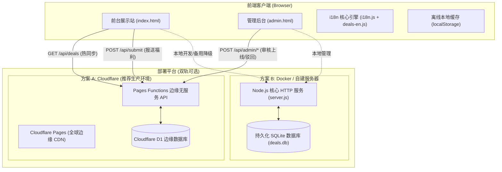

# 🎓 AI 学生折扣站 · AI Student Deals

> **2026 年全球 AI 学生福利与教育折扣完全聚合站** —— 深度收录 **40+ 项** 正在生效的高价值官方学生权益，覆盖 **AI 大模型、AI 编程、云与算力、开发者礼包、搜索研究、办公生产力、设计视频、学习数据** 八大核心赛道，并特别定制 **🇨🇳 中国大陆专区**。

<div align="center">

[](https://aistu.walmartapi.com)
[](https://aistu.walmartapi.com/admin)
[](https://github.com/Xchat1/ai-education-discount)

[](https://aistu.walmartapi.com)
[](https://github.com/Xchat1/ai-education-discount)
[](https://aistu.walmartapi.com)
[](https://aistu.walmartapi.com/#deals)
[](https://aistu.walmartapi.com/#value)
[](./LICENSE)

[🌐 在线体验](https://aistu.walmartapi.com) · [⚙️ 管理后台](https://aistu.walmartapi.com/admin) · [📖 部署文档](#-部署与运行方式) · [📡 API 接口](#-开放-api-接口文档) · [🗺️ 路线图](#-组合战略路线图) · [🤝 提交福利](https://aistu.walmartapi.com/#submit)

</div>

---

## 🌐 线上生产直达

| 访问入口 | 生产地址 | 说明 |
| :--- | :--- | :--- |
| **🌍 生产主域名** | **[https://aistu.walmartapi.com](https://aistu.walmartapi.com)** | 全球 CDN 毫秒级分发，中英双语、多维筛选与交互图表 |
| **⚙️ 管理审核控制台** | **[https://aistu.walmartapi.com/admin](https://aistu.walmartapi.com/admin)** | 提交审核、上线发布、数据修改与删除（默认密码见下文） |
| **⚡ 备用 CF 边缘域名** | [https://ai-education-discount.pages.dev](https://ai-education-discount.pages.dev) | Cloudflare Pages 默认官方子域名备份 |
| **📡 公开福利 API** | [https://aistu.walmartapi.com/api/deals](https://aistu.walmartapi.com/api/deals) | Cloudflare D1 边缘数据库实时驱动的 JSON 接口 |
| **🤖 LLMs.txt 知识索引** | [https://aistu.walmartapi.com/llms.txt](https://aistu.walmartapi.com/llms.txt) | 面向 SearchGPT / Perplexity / Claude 的无损知识源 |

> 🔑 **管理后台默认密码**：`admin123456`（支持在 Docker 环境或 Cloudflare 控制台添加为加密密文 `ADMIN_PASSWORD` 随时修改）。

---

## ✨ 核心特性

- **🎯 状态与优先级可视化**：
  - 🟢 **强烈建议** · 🟡 **有条件/地区限制** · 🔵 **学生折扣** · ⚪ **免费教育版** · 🔴 **暂无稳定计划**
  - **Tier S**（必申神券）、**Tier A**（推荐申请）、**Tier B**（备选/按需）
- **🌐 深度彻底的国际化 (i18n)**：
  - 默认中文 (`zh-CN`)，支持一键无感、无刷新切换为纯正英文 (`EN`)。
  - **不仅翻译 UI 按钮，全量 40 条福利卡片、详情弹窗、图表、Toast 提示及管理后台全部实现中英双向映射**。
  - 本地 `localStorage` 自动持久化记忆用户语言偏好。
- **🇨🇳 专属中国大陆专区**：
  - 一键筛选无需海外网络、无需 SheerID、仅凭校园邮箱或学信网学生认证即可直接申请的福利（如豆包、通义千问、火山方舟、Dify、百度文心等）。
- **⏳ 临期倒计时预警**：
  - 算法自动比对最近 3 个即将到期的活动福利，毫秒级天数倒计时并高亮紧急提示。
- **🗺️ 六大组合战略路线图**：
  - 从 **AI 基石** → **AI 编程** → **云与算力** → **学习科研** → **设计媒体** → **大陆直连**，提供清晰科学的申请顺序。
- **📊 价值测算与可视化图表**：
  - 动态 SVG 环形图 + 渐变条形图，直观拆解商业正价折算的 **$2,500+** 年化价值结构。
- **📝 用户前台自提 + 管理后台审核全闭环**：
  - 前台用户发现新福利可直接填报，自动推入审核队列；
  - 管理员后台一键过审上线、驳回、修改或删除；
  - 审核通过后，全站实时热同步展现，无需重新打包编译！
- **🚀 零外部构建依赖**：
  - 前端原生 ES6 Modules + CSS 现代化玻璃拟态，纯静态双击可开；后端原生轻量化，无繁重 npm 依赖。

---

## 🏛️ 系统架构与数据流



---

## 🏆 2026 核心核心必领福利 (Tier S 精选)

| 福利名称 | 提供商 | 核心价值 | 申请难度 | 大陆可用性 | 关键权益与说明 |
| :--- | :--- | :--- | :--- | :--- | :--- |
| **GitHub Student Pack** | GitHub | **$1,200+/年** | ⭐⭐ 2星 | 🟢 大陆可申 | 80+ 顶级开发者工具、GitHub Pro、大量云额度，两至三年复验 |
| **GitHub Copilot Student**| GitHub | **$120/年** | ⭐⭐ 2星 | 🟢 大陆可申 | 学生期内完全免费，无限代码补全、Chat、Agent 自动调试 |
| **Google Gemini 学生计划** | Google | **$239.88/年** | ⭐⭐ 2星 | 🟡 需外网+美区 | 免费 12 个月 Google AI Pro (Gemini 1.5 Pro + 5TB 云存储) |
| **ChatGPT Plus 学生优惠** | OpenAI | **$80** | ⭐⭐⭐ 3星 | 🟡 需 SheerID | 返校季限时 4 个月免费 Plus 订阅 ($20/月 × 4) |
| **Azure for Students** | Microsoft | **$100 额度** | ⭐⭐ 2星 | 🟢 免信用卡 | $100 免费额度 + 12 个月常用云资源，可用于 Azure OpenAI 部署 |
| **JetBrains 学生许可证** | JetBrains | **$200+/年** | ⭐⭐ 2星 | 🟢 大陆可申 | IntelliJ、PyCharm 等全家桶旗舰版全免费，支持中国高校学信网 |
| **AWS Kiro for Students** | Amazon | **$240/年** | ⭐⭐⭐ 3星 | 🟡 需参与院校 | 每月 1,000 credits 连续 12 个月，免信用卡，支持浏览器免安装 IDE |
| **火山方舟高校师生计划** | 字节跳动 | **1 亿 Tokens** | ⭐⭐ 2星 | 🟢 大陆直连 | 覆盖豆包 Seed、DeepSeek-V4、GLM、Kimi 等，大模型科研利器 |
| **豆包开学季学生优惠** | 字节跳动 | **3 个月免费** | ⭐ 1星 | 🟢 大陆直连 | 免费 3 个月会员，专属开学技能专区，中国高校学生直接秒领 |

*(更多 30+ 项福利包括 Notion, Figma, Overleaf, Replit, Cursor, Windsurf, Dify, Kaggle 等请直接查阅线上站点)*

---

## 🚀 部署与运行方式

本项目支持三种部署方案：**Cloudflare 边缘托管（最推荐）**、**Docker 容器自建** 以及 **纯静态本地双击运行**。

### 方式一：Cloudflare Pages + D1 边缘部署 (推荐，永久 0 成本)

依托 Cloudflare 全球 Anycast 边缘网络，享受免运维、自动 HTTPS 与超快访问速度：

#### 1. 克隆项目
```bash
git clone https://github.com/Xchat1/ai-education-discount.git
cd ai-education-discount
```

#### 2. 创建并初始化 D1 数据库
```bash
# 登录 Cloudflare（若首次使用）
npx wrangler login

# 创建 D1 数据库
npx wrangler d1 create ai_deals_db
```
终端输出类似：
```toml
[[d1_databases]]
binding = "DB"
database_name = "ai_deals_db"
database_id = "49074bf6-1f5c-45a8-a410-a558f5930405"
```
将生成的 `database_id` 更新至项目根目录的 [`wrangler.toml`](./wrangler.toml)。

#### 3. 执行 SQL 初始化 40 条全量数据
```bash
npx wrangler d1 execute ai_deals_db --file=schema.sql --remote
```

#### 4. 创建 Pages 项目并部署
```bash
# 创建 Pages 项目
npx wrangler pages project create ai-education-discount --production-branch=main

# 部署全站与 Functions 边缘 API
npx wrangler pages deploy . --project-name=ai-education-discount --branch=main
```

#### 5. （可选）配置生产安全密钥与自定义域名
- **自定义域名**：进入 Cloudflare 控制台 -> **Workers & Pages** -> `ai-education-discount` -> **Custom domains**，绑定你的专属域名（如 `aistu.walmartapi.com`）。
- **管理员密码设置**：
  ```bash
  npx wrangler pages secret put ADMIN_PASSWORD --project-name=ai-education-discount
  # 根据提示输入你专属的高强度管理密码
  ```

---

### 方式二：Docker 一键部署 (推荐私有服务器 / NAS)

项目已完整封装轻量级 Dockerfile 与 docker-compose，内置持久化 SQLite 数据库与 Node.js 核心服务：

```bash
# 一键拉起后台容器
docker compose up -d

# 查看容器运行日志
docker compose logs -f
```

- **前台展示站**：`http://<你的服务器IP>:3000`
- **管理审核后台**：`http://<你的服务器IP>:3000/admin`
- **数据持久化位置**：本地挂载目录 `./data/deals.db`，升级容器数据不丢失。
- **自定义管理员密码**：在 `docker-compose.yml` 中配置环境变量 `ADMIN_PASSWORD` 即可。

---

### 方式三：本地纯静态开发 / 离线模式

无需任何后端依赖或 Node.js 环境，直接双击运行：

```bash
# 直接在浏览器打开
open index.html

# 或使用 Python 快速启动本地 HTTP 预览
python3 -m http.server 8848
```
*在离线模式下，前台所有功能（40 条福利、双语切换、图表、筛选）均正常可用，用户提交的新福利将自动降级保存在浏览器本地 localStorage 中。*

---

## ⚙️ 管理审核系统与工作流

系统具备成熟的投稿-审核-上线流转机制：

```
[用户前台提交新福利] ──> [/api/submit] ──> [进入待审核队列 (pending)]
                                                   │
                                            [管理员登录 /admin]
                                                   │
                        ┌──────────────────────────┴──────────────────────────┐
                        ▼                                                     ▼
                  【点击通过上线】                                       【点击驳回/删除】
                        │                                                     │
             [review_status = approved]                               [移出公开展示队列]
                        │
       [前端全自动热同步展示 (热刷新)]
```

1. **用户前台提交**：访问首页底部的「提交福利」表单填报新福利，数据将通过 `/api/submit` 异步推入待审队列。
2. **管理员登录**：进入 `/admin`（支持直接输入访问），输入管理员密码完成鉴权。
3. **审核与管理功能**：
   - ⏳ **待审核队列**：查看提交人联系方式、申请入口与权益说明，支持 **一键通过上线**、**编辑完善并发布**、**驳回** 或 **彻底删除**。
   - 🟢 **已上线福利**：支持搜索、按类别筛选，随时对 40+ 条福利进行修改或下线处理。
   - ➕ **手动直录**：点击右上角「手动录入新福利」，可直接绕过审核创建正式条目。
   - 🔄 **前台全自动热同步**：一旦审核通过，前台页面无需重新打包编译，动态无缝同步展示最新福利！

---

## 📡 开放 REST API 接口文档

线上与本地环境通用一套标准 RESTful API 规范：

### 1. 公开端点

#### 获取已审核上线的福利列表
```http
GET /api/deals
```
- **响应示例**：`200 OK`
```json
[
  {
    "id": "github-pack",
    "name": "GitHub Student Developer Pack",
    "vendor": "GitHub",
    "tier": "S",
    "status": "hot",
    "value": "$400+ 权益",
    "valueNum": 400,
    "duration": "学生身份持续有效",
    "cn": "ok",
    "tags": ["80+ 资源", "薅羊毛之王", "2年复验"],
    "summary": "学生薅羊毛之王...",
    "url": "https://education.github.com/pack"
  }
]
```

#### 用户提交新福利
```http
POST /api/submit
Content-Type: application/json

{
  "name": "Runway 学生计划",
  "vendor": "Runway",
  "category": "design",
  "value": "$120/年",
  "status": "conditional",
  "cn": "partial",
  "deadline": "2026-12-31",
  "url": "https://runwayml.com/education",
  "desc": "面向设计与影视专业在校学生...",
  "contact": "student@university.edu"
}
```

---

### 2. 管理员端点 (需鉴权)

#### 管理员密码登录
```http
POST /api/admin/login
Content-Type: application/json

{ "password": "your-admin-password" }
```
- **响应**：返回 Bearer Token，格式：`{ "success": true, "token": "..." }`。

#### 管理员获取福利列表与 KPI
```http
GET /api/admin/deals?status=pending&q=关键词
Authorization: Bearer <token>
```
- **返回**：条目列表与各状态统计计数器 (`pending`, `approved`, `rejected`, `total`)。

#### 审核操作 (上线/驳回/编辑/删除/创建)
```http
POST /api/admin/review
Authorization: Bearer <token>
Content-Type: application/json

{
  "id": "deal-id",
  "action": "approve" // 可选: approve | unpublish | reject | delete | create
}
```

---

## 🌐 国际化 (i18n) 设计与扩展

项目通过 [`assets/js/i18n.js`](./assets/js/i18n.js) 与 [`assets/js/deals-en.js`](./assets/js/deals-en.js) 实现无构建依赖的双语架构：

1. **核心字典结构**：
   - `I18N.zh` 与 `I18N.en` 严格 1:1 对称，拥有 **231 个** 全面覆盖的 UI 与提示词键值。
2. **40 条全量福利英文映射 (`DEALS_EN`)**：
   - 每一条福利均有匹配的英文名、时长、价值、标签、摘要、亮点与避坑注意事项。
   - 前端在渲染与搜索时自动调用 `localizeDeal(deal)` 完成无感英文化。
3. **增加或修改英文条目**：
   - 打开 `assets/js/deals-en.js`，在 `DEALS_EN` 对象中添加对应福利 `id` 的翻译块即可。

---

## 🤖 GEO 与 AI 搜索引擎优化

为确保生成式 AI 搜索引擎（如 Perplexity, ChatGPT Search, Claude, Gemini）能精准理解并引用本站数据，项目部署了全套 GEO 最佳实践：

1. **LLMs.txt 协议**：
   - 访问 [`https://aistu.walmartapi.com/llms.txt`](https://aistu.walmartapi.com/llms.txt) 查看符合规范的轻量化知识索引。
   - 访问 [`https://aistu.walmartapi.com/llms-full.txt`](https://aistu.walmartapi.com/llms-full.txt) 查看 40 条福利的高密度纯文本完整版。
2. **Schema.org JSON-LD 结构化数据**：
   - 包含完整的 `WebSite`, `CollectionPage`, `ItemList` 与 `FAQPage` 富文本结构，助力在搜索引擎中呈现富媒体卡片。
3. **动态 SEO 响应**：
   - 语言切换时，HTML `lang`、`document.title` 与 `<meta name="description">` 自动动态响应。

---

## 🎓 在校学生认证避坑秘籍

1. **学信网认证通用技巧（适用于国内高校学生）**：
   - 国内大学即使没有提供官方 `@edu.cn` 校园邮箱，在遇到 SheerID 或人工审核平台（如 GitHub、JetBrains、Azure、Figma）时，均可前往学信网免费下载**《教育部学籍在线验证报告》**（带在线二维码的中文或英文翻译件 PDF），上传后通常可在 1-2 个工作日内通过人工验证。
2. **严防自动续费陷阱**：
   - 凡需绑定支付卡（如 Gemini 学生免费 1 年）的平台，必须在日历中设置 **到期日前 7 天的取消提醒**，防止第二年按原商业高价自动扣款。
3. **切勿购买买卖学生认证账号**：
   - 淘宝、闲鱼等渠道售卖的所谓“代过 SheerID”、“学生邮箱”、“永久 GitHub Pack”大多使用黑产假材料或被盗用组织，极易触发平台批量风控封号，甚至连带个人主账号受损。

---

## 📁 完整目录结构

```
ai-education-discount/
├── index.html              # 🌐 前台单页应用（深色极光视觉、多维筛选、图表、提交表单）
├── admin.html              # ⚙️ 专属管理审核后台（KPI 看板、审核流转、条目编辑）
├── server.js               # 🚀 Node.js 核心后端服务（内置轻量 SQLite 引擎与 REST API）
├── Dockerfile              # Docker 镜像构建配置
├── docker-compose.yml      # Docker 编排配置（包含持久化数据卷挂载）
├── wrangler.toml           # ☁️ Cloudflare Pages 配置文件（绑定 D1 数据库与环境）
├── schema.sql              # 📊 D1 / SQLite 数据库初始化脚本与 40+ 条预置种子数据
├── functions/              # ⚡ Cloudflare Pages Functions 边缘 API
│   ├── _utils.js           # 格式化、鉴权与响应工具函数
│   └── api/
│       ├── deals.js        # 公开接口：获取已审核上线福利
│       ├── submit.js       # 公开接口：用户提交新福利
│       └── admin/          # 管理员专属接口 (login, deals, review)
├── assets/
│   ├── css/
│   │   ├── style.css       # 前台核心样式（深色玻璃拟态、流动极光背景、响应式排版）
│   │   └── admin.css       # 管理后台专用样式（KPI 卡片、状态徽章、模态对话框）
│   └── js/
│       ├── data.js         # 前端预置全量 40 条福利数据（离线兜底源）
│       ├── deals-en.js     # 🌐 40 条福利全量深度英文翻译字典
│       ├── i18n.js         # 🌐 国际化多语言核心引擎（231 个对称键值、事件重绘机制）
│       ├── app.js          # 前台业务逻辑（卡片渲染、路线图、价值测算、表单流转）
│       └── admin.js        # 管理后台业务逻辑（鉴权登录、KPI 计算、审核交互）
├── llms.txt                # 🤖 GEO 知识索引规范文档（供 AI 搜索引擎深度理解）
├── llms-full.txt           # 🤖 40 条福利全量无损 Markdown 知识文档
├── sitemap.xml             # 🗺️ 搜索引擎站点地图
├── robots.txt              # 🤖 搜索引擎与 AI 爬虫抓取规则
├── package.json            # 项目依赖与启动脚本
├── .env.example            # 环境变量配置模板
├── LICENSE                 # MIT 开源协议
└── README.md               # 项目完整中英文使用与部署指南
```

---

## 🤝 参与贡献与建议

欢迎广大开发者与高校同学参与共建！

- 🐛 **反馈 Bug / 提供建议**：[提交 GitHub Issue](https://github.com/Xchat1/ai-education-discount/issues)
- 💡 **发现新的 AI 学生福利**：
  - 方式 A：直接在 [生产前台网页](https://aistu.walmartapi.com/#submit) 提交，由管理员审核后同步上线；
  - 方式 B：Fork 本仓库，修改 `assets/js/data.js` 与 `assets/js/deals-en.js` 后提起 Pull Request。
- 🌐 **优化英文翻译**：欢迎补充和润色 `assets/js/deals-en.js`。

---

## ⚠️ 免责声明

1. 本项目为**公益性开源信息聚合平台**，所有福利信息均收集整理自各大科技厂商公开页面。学生权益属于高频变动政策，申请前请务必以官方页面实时说明为准。
2. 本站**不代理申请、不售卖任何学生账号或认证服务**。切勿相信任何声称能“代刷认证”的第三方黑产。
3. 文中引用的各品牌 Logo、商标与商号版权均归其各自所属公司所有。

---

## 📄 License

本项目基于 [MIT License](./LICENSE) 开源。

Copyright (c) 2026 [Xchat1](https://github.com/Xchat1). 欢迎自由 Fork、二次开发与自建部署，保留原始署名即可。
